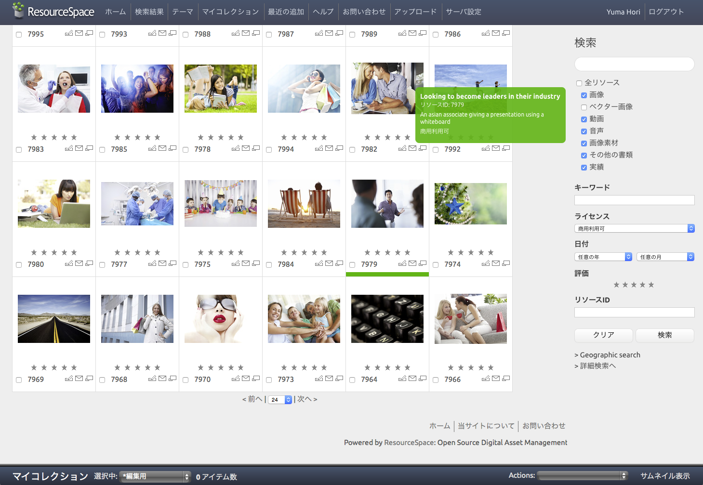
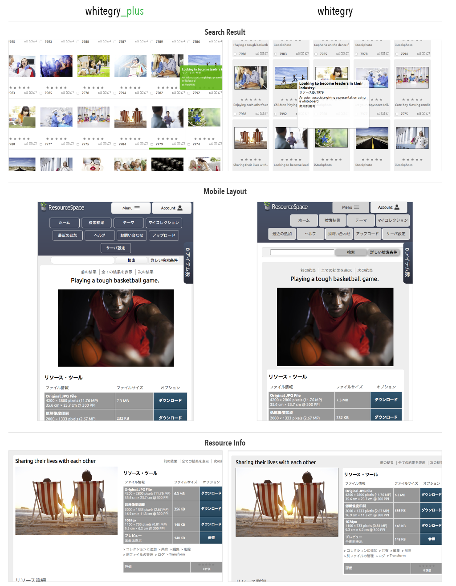

col-whitegry_plus
=========

## Introduction

col-whitegry_plus is a CSS theme for ResourceSpace, based on col-whitegry.
This theme mods some unsophisticated issues of default theme.

* good-looking search result page
* smooth touch scrolling on iOS
* replacing poor button styles when responsive plugin enabled

## Screenshot




## Requirement

* ResourceSpace Revision 7009 or later
* rse_responsive plugin

## Installation

1. Download the theme to `resourcespace/plugins`
2. Login as administrator and go to Team center > Manage plugins
3. Expand "Enterprise" section and activate rse_responsive
4. Expand "User Interface" section and activate col-whitegry_plus
5. (Optional) Set recommended configs to your `resourcespace/include/config.php` file

### Recommended Configs
```php
# Enable AJAX popup info box on search results.
$infobox=true;
# Display a small resource file type icon in the info box?
$infobox_display_resource_icon=false;
# An alternative mode for the InfoBox, that displays the preview image instead of any metadata.
$infobox_image_mode=false;

# Enable user rating of resources
# Users can rate resources using a star ratings system on the resource view page.
# Average ratings are automatically calculated and used for the 'popularity' search ordering.
$user_rating=false;
# Display User Rating Stars in search views (a popularity column in list view)
$display_user_rating_stars=true;

# Use checkboxes for selecting resources
$use_checkboxes_for_selection=true;

# Option to show resource ID in the thumbnail, next to the action icons.
$display_resource_id_in_thumbnail=true;

# Image preview zoom using jQuery.zoom (hover over the preview image to zoom in on the resource view page)
$image_preview_zoom=true;
```

## License

MIT License
